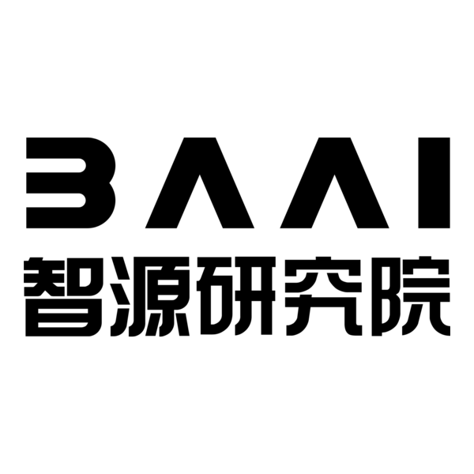

# LibRAGrian

[](https://huggingface.co/datasets/stas/gutenberg-100)
[](https://colab.research.google.com/github/theophile-bb/LibRAGrian/blob/main/LibRAGrian.ipynb)


LibRAGrian is a personal Python project showcasing a complete Retrieval-Augmented Generation (RAG) pipeline built from open-source components. It processes and chunks large text (books) before embedding, indexing and retrieving them.

The stack used revolves around :

<p align="center">
  <a href="https://github.com/chonkie-inc/chonkie/">
    
  </a>
  <a href="https://huggingface.co/BAAI">
    
  </a>
  <a href="https://huggingface.co/Qwen">  
    
  </a>
</p>


- [**Chonkie Chunker**](https://github.com/chonkie-inc/chonkie/) for chunking

- [**bge-small-en-v1.5**](https://huggingface.co/BAAI) model for embedding
  
- [**Qwen 2.5-3b**](https://huggingface.co/Qwen) for retrieval

---

## Project Structure

LibRAGrian/ <br>
│ <br>
├── 📁 src/ <br>
│   ├── __init__.py      <br>
│   └── utils.py         <br>
│ <br>
├── 📓 LibRAGrian.ipynb  <br>
│ <br>
├── 📄 requirements.txt  <br>
├── 📄 .gitattributes    <br>
├── 📄 .gitignore       <br>
└── 📝 README.md        <br>

---

## 📋 Prerequisites

This project requires:

- Python 3.10+
- A working Python environment (venv, conda, etc.)

---

## ⚙️ Installation

Clone the repository and install dependencies:

```
$ git clone https://github.com/theophile-bb/LibRAGrian.git
$ cd LibRAGrian
$ pip install -r requirements.txt
```
---

## Getting the data

The data used for this project are available on Hugging Face at this address : https://huggingface.co/datasets/stas/gutenberg-100.

---

## Notebook

The main notebook LibRAGrian.ipynb walks through:

- Text processing and cleaning.

- Chunking of the books using **Chonkie Chunker**.

- Embedding of the chunks using the **bge-small-en-v1.5** model.

- Indexing of the embeddings with **Faiss**.

- Retrieval with the **Qwen 2.5-3b** model.

- Querying with examples.

---

## Examples of Query / Answer

Query :
> Can you tell me about all the Jules Verne books you have heard of ?

Answer : 
```
Jules Verne is known for writing several notable books including "Five Weeks in a Balloon", "Journey to the Center of the Earth", "Around the World in Eighty Days", "Michael Strogoff", "From the Earth to the Moon; and, Round the Moon", and "Twenty Thousand Leagues Under the Seas". There are also references to other works like "The Mysterious Island" and "Twenty Thousand Leagues Under the Seas: An Underwater Tour of the World". However, the list provided in the context seems to be incomplete as it doesn't include all of his works. To get a comprehensive list, one would need to consult a full bibliography of Jules Verne's works. "Twenty Thousand Leagues Under the Seas: An Underwater Tour of the World" appears to be a separate volume or edition of "Twenty Thousand Leagues Under the Seas".
```

Query :
> Who is the main character in the book Twenty Thousand Leagues Under the Seas ? Can you descibe him/her a bit ?

Answer : 
```
Captain Nemo is the main character in the book Twenty Thousand Leagues Under the Seas. He is described as a mysterious figure who built a futuristic submarine called the Nautilus. Captain Nemo is also known for his secretive background and his rebellious nature, as he conducts an underwater campaign of vengeance against his imperialist oppressor. He is portrayed as a strong-willed individual who prefers solitude and freedom beneath the sea. Captain Nemo is also a skilled navigator and scientist, as evidenced by his ability to conduct astronomical observations and his knowledge of marine life. His interactions with the narrator, Professor Aronnax, and his companions reveal his complex personality, including moments of haughtiness and moments of kindness. Captain Nemo is a central figure in the novel, driving the plot forward through his actions and decisions. Based on the context provided, Captain Nemo is a complex character who embodies themes of rebellion and freedom.
```

Query :
> What is the plot about in the book The Strange Case of Dr. Jekyll and Mr. Hyde ?

Answer : 
```
The Strange Case of Dr. Jekyll and Mr. Hyde revolves around the mysterious transformation of Dr. Henry Jekyll into Mr. Edward Hyde. Initially, Dr. Jekyll is a respectable lawyer and scientist who experiments with a potion that allows him to transform into a darker, more violent version of himself, Mr. Hyde. This transformation leads to a series of disturbing events, including the murder of Sir Danvers Carew and the disappearance of Mr. Hyde. As Dr. Jekyll's life spirals into chaos, he becomes increasingly isolated and fearful, eventually leading to his own demise. The story also explores themes of morality, guilt, and the duality of human nature. "Mr. Hyde" is a malevolent force that emerges from within Dr. Jekyll, embodying his darkest impulses and desires. The narrative delves into the consequences of indulging in forbidden desires and the moral implications of such actions.
```

Query :
> What is the plot about in the book The Skylark of Space ?

Answer : 
```
The plot revolves around the construction and eventual successful flight of a spacecraft named Skylark by inventors Seaton and Crane. The story involves their journey to rescue Dorothy, who is in danger, and their subsequent travels through space encountering various challenges including a malfunctioning space-car, a mysterious alien race, and a dangerous enemy. The narrative also includes elements of romance and scientific discovery. The Skylark ultimately lands safely and the characters encounter new civilizations and cultures. The story concludes with the characters deciding whether to stay with the new civilization or continue their journey. The plot is characterized by adventure, exploration, and technological advancement. The characters face numerous obstacles and dilemmas, showcasing their ingenuity and determination. The narrative also delves into themes of friendship, loyalty, and the ethical implications of their actions. The story is filled with suspense, action, and romance, making it a thrilling interplanetary adventure. The characters' interactions and decisions drive the plot forward, leading to a satisfying conclusion.
```

Query :
> Among all the books you know who is the most evil character you've seen ? The one with the least moral values or who causes the most pain

Answer : 
```
The most evil character described in the provided excerpts appears to be Victor Frankenstein. He creates a monster that he abandons, leading to the deaths of several people including his fiancé Elizabeth and his friend William. Frankenstein actively pursues revenge against his creation, showing extreme cruelty and disregard for human life. The monster, while portrayed as a tragic figure, is still depicted as causing significant harm and suffering. However, Victor Frankenstein's actions and intentions are consistently portrayed as malicious and harmful throughout the text. To directly quote from the context: "Frankenstein discovered that I made notes concerning his history; he asked to see them and then himself corrected and augmented them in many places, but principally in giving the life and spirit to the conversations he held with his enemy." This indicates Frankenstein's active role in creating and controlling the monster, despite his initial abandonment. Therefore, Victor Frankenstein stands out as the most evil character due to his deliberate creation of a destructive entity and his pursuit of vengeance.
```

Query :
> In the novel The Time Machine, how long did it take to build the machine ?

Answer : 
```
Two years. The Time Traveller stated, "It took two years to make" the model machine. To build the actual machine, he mentioned, "I expected to finish it on Friday; but on Friday, when the putting together was nearly done, I found that one of the nickel bars was exactly one inch too short, and this I had to get remade; so that the thing was not complete until this morning." However, the exact duration for the actual machine is not specified in the given context.
```
